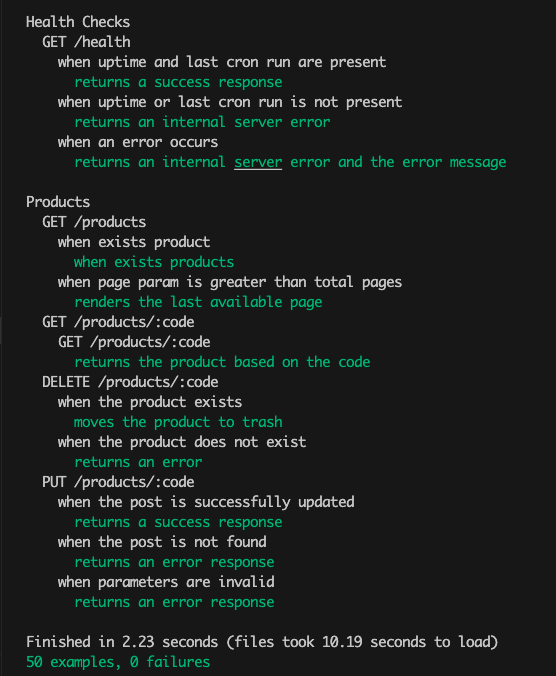
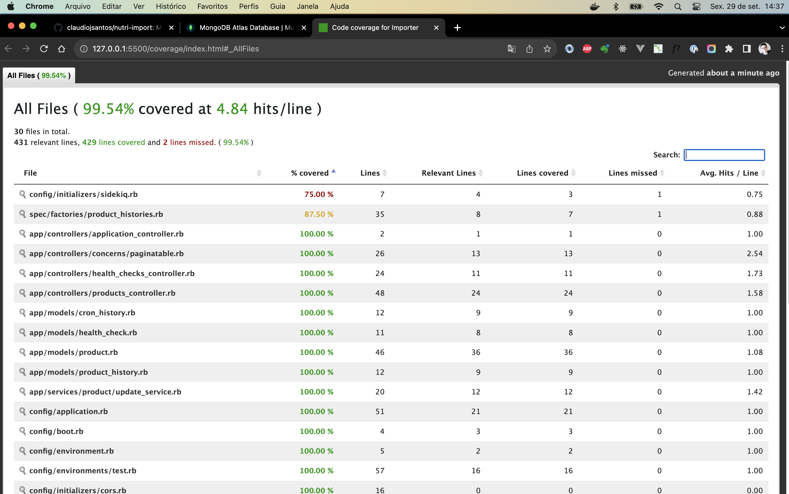
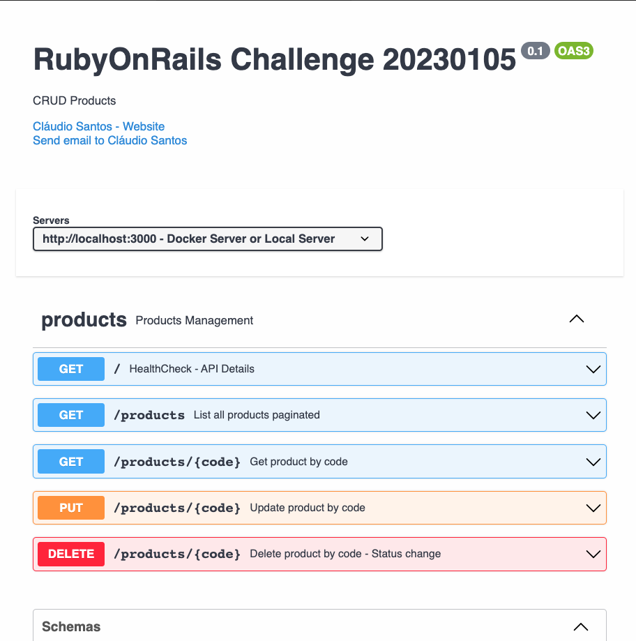

a# Backend Challenge 20230105 Ruby on Rails - Projeto Nutri-Import

Projeto de importação de dados nutricionais de alimentos com API de consulta de dados, utilizando Ruby on Rails e MongoDB.

## <u>**Tecnologias e Pré-requisitos**</u>

Estas são as tecnologias e os pré-requisitos para a execução do projeto:
- Ruby 3.2.2
- Rails 7.0.8
- MongoDB
- Docker
- Mongo DB Atlas Database (Caso deseje se conectar diretamente ao caso deseje utilizar o serviço em nuvens)

## <u>**Instalação**</u>

O endereço do repositório é:

https://github.com/claudiojsantos/nutri-import

Utilizando o Docker, execute os comandos abaixo:

```sh
docker-compose build
docker-compose up -d (-d é opcional caso deseje deixar livre seu terminal livre)
```

Caso deseje instalar localmente, considerando que já tenha o Ruby e o MongoDB instalados, execute os comandos abaixo:

```sh
bundle install
rails s
redis-server
bundle exec sidekiq
```  

Caso deseje utilizar o serviço em nuvens, altere o arquivo `config/mongoid.yml` com as informações de conexão do seu banco de dados.

```sh
development:
  clients:
    default:
      uri: <"url do banco do cluster">
      options:
        server_selection_timeout: 5
        roles:
          - "dbOwner"
        use_utc: false
        server_api:
          version: "1"
  options:
    raise_not_found_error: false
```

Para executar os testes automatizados, execute o comando abaixo:

```sh
rspec
```



Ao executar o comando acima, será gerado um relatório de cobertura de testes, que pode ser visualizado no browser no arquivo `coverage/index.html`



---
## <u>**Utilização**</u>

A documentação da API encontra-se no diretório doc do projeto.



Existe um cron programado para executar a importação de dados diariamente às 00:00. Para executar manualmente, execute o comando abaixo:

```sh
rails c
EnqueueImportJobsWorker.perform_async
```

This is a challenge by [Coodesh](https://coodesh.com/)
---
**Cláudio Santos**  
**claudio@sistnet.com.br**.  
Linkedin: **https://www.linkedin.com/in/claudio-santos-3b071140/**

